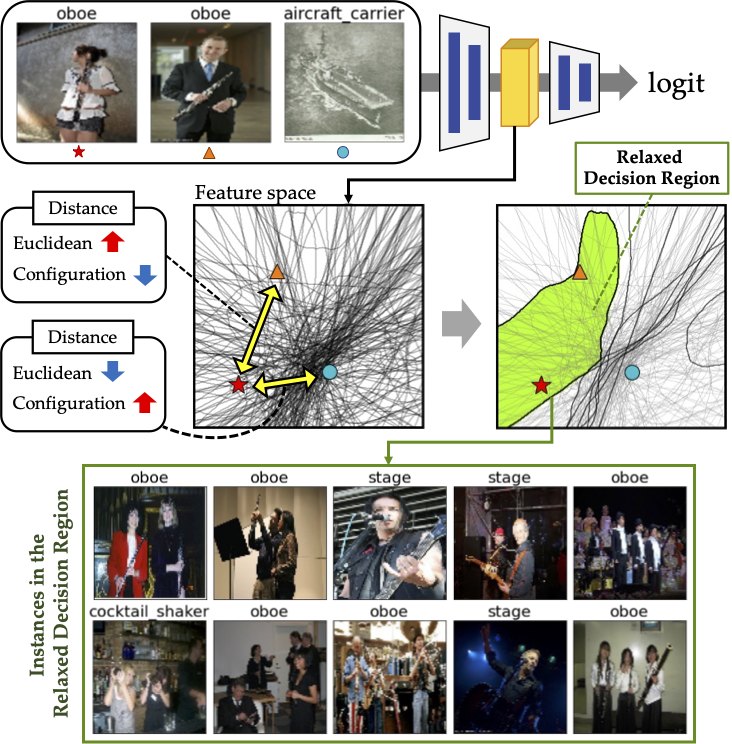

# Relaxed Decision Region

Understanding Distributed Representations of Concepts in Deep Neural Networks without Supervision  
Wonjoon Chang* · Dahee Kwon* · Jaesik Choi (* Equal Contribution)  
\[[Paper]()\]\[[Project]()\]  

This is the official pytorch implementation of Understanding Distributed Representations of Concepts in Deep Neural Networks without Supervision. The paper will be published on AAAI 2024. 

## Abstract
Understanding intermediate representations of the concepts learned by deep learning classifiers is indispensable for interpreting general model behaviors. Existing approaches to reveal learned concepts often rely on human supervision, such as pre-defined concept sets or segmentation processes. In this paper, we propose a novel unsupervised method for discovering distributed representations of concepts by selecting a principal subset of neurons. Our empirical findings demonstrate that instances with similar neuron activation states tend to share coherent concepts. Based on the observations, the proposed method selects principal neurons that construct an interpretable region, namely a \textit{Relaxed Decision Region (RDR)}, encompassing instances with coherent concepts in the feature space. It can be utilized to identify unlabeled subclasses within data and to detect the causes of misclassifications. Furthermore, the applicability of our method across various layers discloses distinct distributed representations over the layers, which provides deeper insights into the internal mechanisms of the deep learning model.

## Citation
If you find this repo useful, please cite our paper. 

